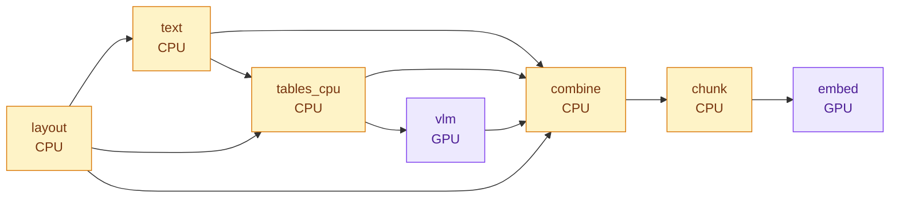

<!-- stage_diagram.py가 생성한다. 손으로 고치지 말 것. -->
# 단계 DAG

> `insurance_chunker/stage_runner.py`의 `ORDER`·`UPSTREAM`과
> `stages.py`의 `StageResult` 자원 태그에서 생성한다.

```mermaid
flowchart LR
  layout["layout<br/>CPU"]
  text["text<br/>CPU"]
  tables_cpu["tables_cpu<br/>CPU"]
  vlm["vlm<br/>GPU"]
  combine["combine<br/>CPU"]
  chunk["chunk<br/>CPU"]
  embed["embed<br/>GPU"]

  layout --> text
  text --> tables_cpu
  layout --> tables_cpu
  tables_cpu --> vlm
  text --> combine
  tables_cpu --> combine
  vlm --> combine
  layout --> combine
  combine --> chunk
  chunk --> embed

  classDef cpu fill:#fef3c7,stroke:#d97706,color:#78350f
  class layout,text,tables_cpu,combine,chunk cpu
  classDef gpu fill:#ede9fe,stroke:#7c3aed,color:#4c1d95
  class vlm,embed gpu
```
